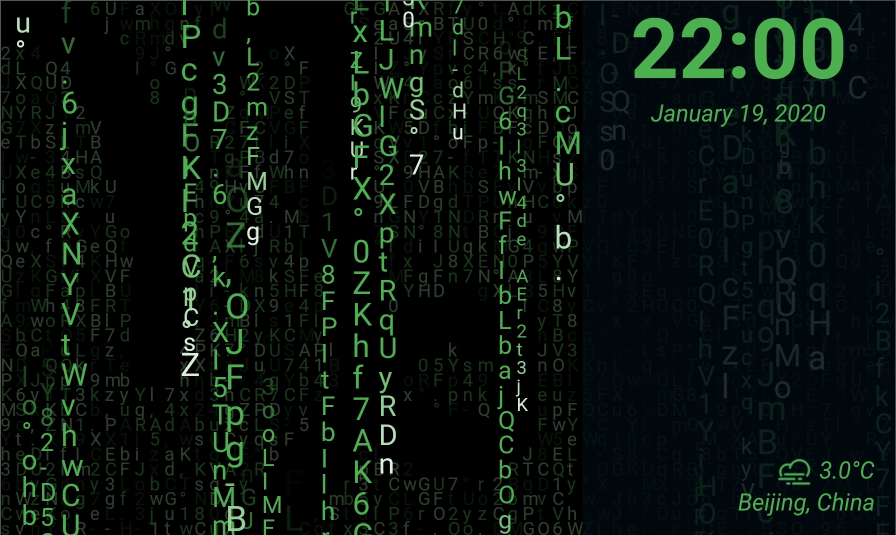
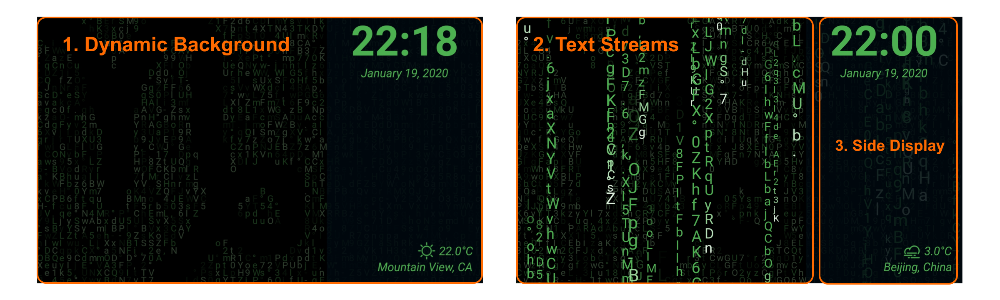
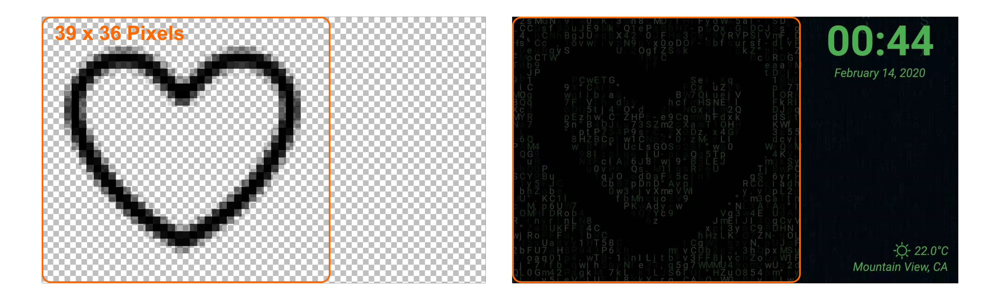

# Digital Clock - Matrix Text Streams

This Flutter application is a digital clock powered with Matrix text streams effects.

# Layout
The main layout of this digital clock is built with the following three main parts. Each part is highlighted with an orange frame.

1. Dynamic Background
> A live background uses a character matrix to construct an image. The image represents an event of the date. It will represent the constellation of the current date. 

2. Text Streams
> Text streams drop from the top of the screen to the bottom, the same effect as the movie Matrix. The character in each stream are selected randomly and the speed of each stream is also various. All of the streams will be reset once every minute.

3. Side Display
> The rest of the useful information is enclosed in this part, including time, date, weather, temperature, and location.

# Configuration
Primary parameters for this clock are stored in the instance of **Configuration** class, which is defined in **lib/common/constant.dart**. Here is a brief introduction to these parameters:

- **sideDisplayFlex** (default: 35)
> Indicates the flex ratio that the side display area will occupy.

- **defaultFontSize** (default: 28)
> The default font size of characters in text streams. The maximum font size of text streams will equal the value of this parameter whereas the minimum font size will be a half. 

- **maxFontSize** (default: 30)
> The maximum font size of characters that will appear on the screens. It should be larger than the defaultFontSize or equal with it at least.

- **maxLocationTextLength** (default: 22)
> Maximum count of characters will display in the location area of side display.

- **leadingCharacters** (default: 5)
> The count of characters which will be treated as leading part of the text streams.  The leading part of a text stream will be applied with gradient colors.

- **tailCharacters** (default: 5)
> The count of characters which will be treated as tail part of the text streams.  The tail part of a text stream will be applied with gradient colors.

- **maxCharacters** (default: 30)
> The maximum length of a text stream.

- **minCharacters** (default: 12)
> The minimum length of a text stream.

- **streamGenerationInterval** (default: 5)
> The generation speed of text streams. The larger the value is, the less text steams will appear on the screen.

- **maxStreamSpeed** (default: 6)
> The maximum speed of text streams. 

- **defaultColor** (default: Colors.green)
> Primary theme color of this clock display.

- **leadingGradientColors** (default: transparent -> defaultColor)
> Gradient colors of leading part of a text stream.

- **tailGradientColors** (default: defaultColor -> Colors.white)
> Gradient colors of tail part of a text stream.

# Events
Currently, the dynamic background supports the following events:

Event Name       | Event Type | Date
:--:                 | :-:        | :-:
Aries                | Horoscope  | Mar. 21 - Arp. 19
Taurus               | Horoscope  | Apr. 20 - May 20
Gemini               | Horoscope  | May 21 - Jun. 20
Cancer               | Horoscope  | Jun. 21 - Jul. 22
Leo                  | Horoscope  | Jul. 23 - Aug. 22
Virgo                | Horoscope  | Aug. 23 - Sep. 22
Libra                | Horoscope  | Sep. 23 - Oct. 22
Scorpio              | Horoscope  | Oct. 23 - Nov. 21
Sagittarius          | Horoscope  | Nov. 22 - Dec. 21
Capricorn            | Horoscope  | Dec. 22 - Jan. 19
Aquarius             | Horoscope  | Jan. 20 - Feb. 18
Pisces               | Horoscope  | Feb. 19 - Mar. 20
Valentine's Day      | Festival   | Feb. 14
Saint Patrick's Day  | Festival   | Mar. 17
Halloween            | Festival   | Oct. 31
Christmas            | Festival   | Nov. 24 - Nov. 25
New Year             | Festival   | Dec. 31

The definition of events are described in the file **assets/events.json**. You can modify that file to support more events.

# Images

### Event Image
The image file for the dynamic background should be stored in PNG format with resolution 60 x36. The area, which has a 39 x 36 grid, on the left side will be the safe area. The content in this area will not be overlapped by the side display. Here is a concrete sample:

In the image, points with **transparent color** (#0000000000) will be mapped to black space on the clock face. The rest points will be filled with random characters on the screen.

### License
All the images under **assets/images** are published under Attribution 3.0 Unported (CC BY 3.0).

#### Attribution:

Files | Author | Link
:--:  | :-:    | :-:
horoscope/* | Chamestudio Pvt Ltd | [https://www.iconfinder.com/iconsets/astronomical-signs](https://www.iconfinder.com/iconsets/astronomical-signs)
weather/* | Fatkhul Karim | [https://www.iconfinder.com/iconsets/weather-line-19](https://www.iconfinder.com/iconsets/weather-line-19)
festival/christmas.png | Squarecup LTD | [https://www.iconfinder.com/iconsets/christmas-2442](https://www.iconfinder.com/iconsets/christmas-2442)
festival/halloween.png | Ionescu Georgiana Lavinia | [https://www.iconfinder.com/iconsets/vegetables-56](https://www.iconfinder.com/iconsets/vegetables-56)
festival/new_year.png | Becris . |[https://www.iconfinder.com/iconsets/chinese-new-year-4](https://www.iconfinder.com/iconsets/chinese-new-year-4)
festival/st\_patrick\_day.png | Alpár-Etele Méder | [https://www.iconfinder.com/icons/3017878/clover_day_patrick_st_icon](https://www.iconfinder.com/icons/3017878/clover_day_patrick_st_icon)
festival/valentine.png | Royyan Wijaya | [https://www.iconfinder.com/iconsets/gradak-interface](https://www.iconfinder.com/iconsets/gradak-interface)
